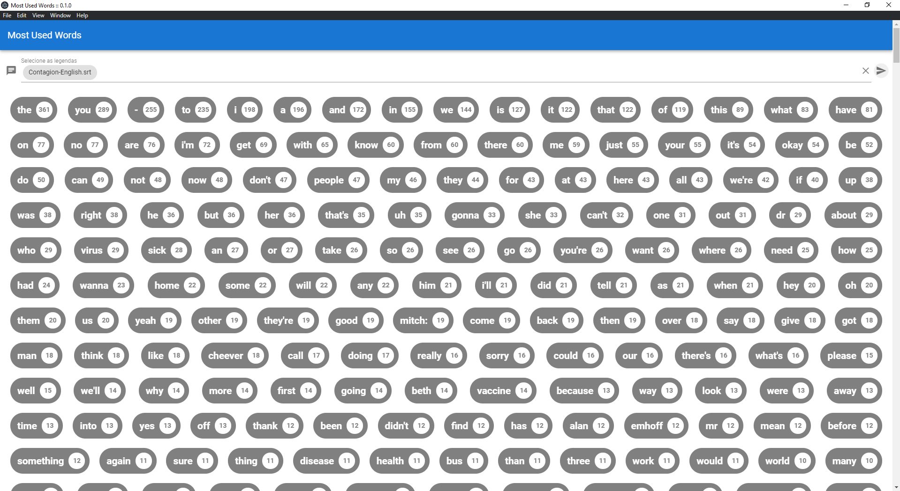

# most-used-words

Application using VueJS and Electron, to obtain the most used words in .srt subtitle files

## Project setup
```
npm install
```

### Compiles and hot-reloads for development
```
npm run serve
```

### Compiles and minifies for production
```
npm run build
```

### Lints and fixes files
```
npm run lint
```

### Customize configuration
See [Configuration Reference](https://cli.vuejs.org/config/).

### Init project electron

npm run electron:serve

